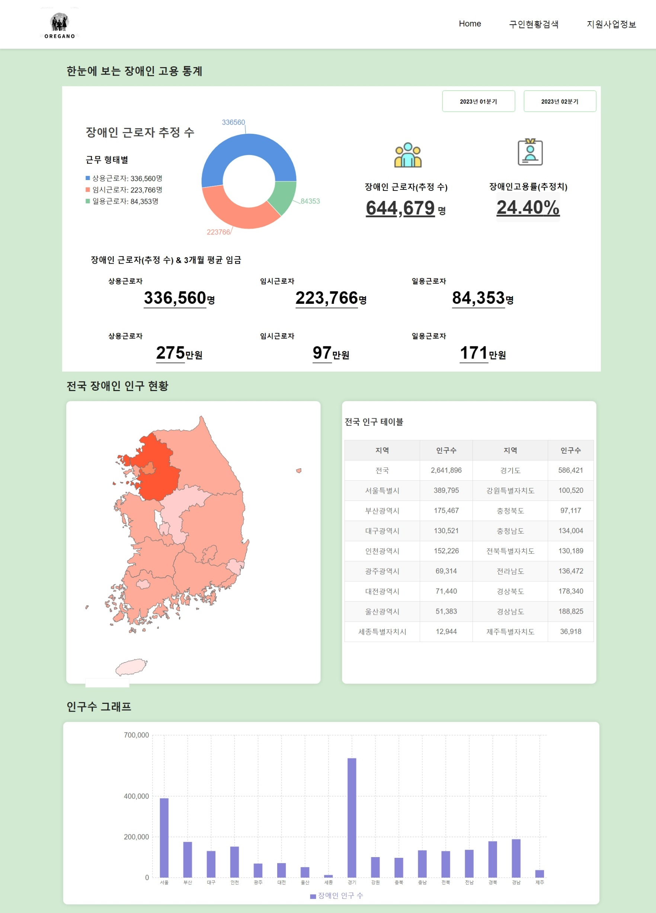
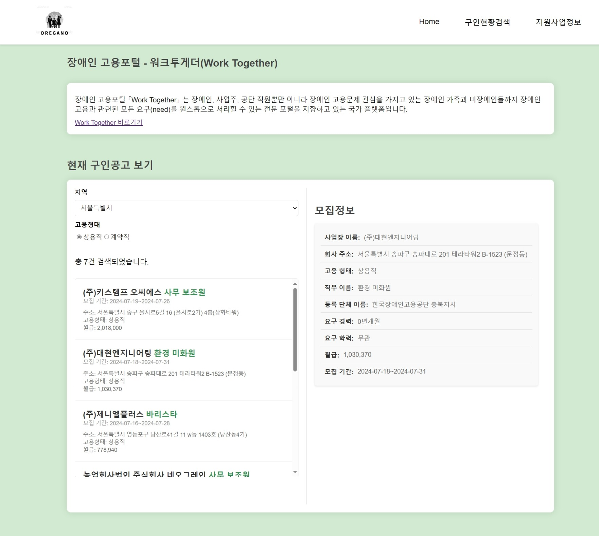
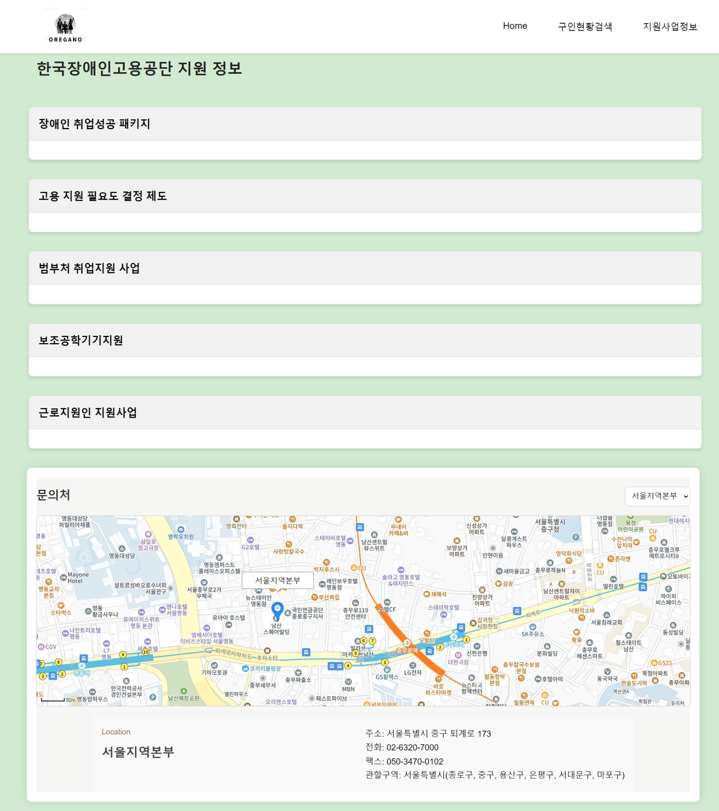

  

# 소개

## :book: 개요

**_👏 장애인들을 위한 구인구직 정보 사이트 👏_**   

> 2024.05.23~2024.06.09

**기존 장애인 고용 공단의 문제점**
> 현재의 장애인고용공단의 웹사이트를 보면 많은 부분에 대한 지원이 이루어져 웹사이트를 처음 접하는 장애인들은 보기 매우 어렵다. 그렇기에 우리는 장애인들을 위해 오직 고용에 초점을 맞춘 서비스를 만들어 고용에 대한 접근성을 향상시킬 것이다.

**간단하게 참고하기 좋은 축약 정보의 부족**
> 장애인들의 구인구직을 위한 정보를 한눈에 볼 수 있게 간단한 사이트를 만들자!

## :date: 공공데이터
📌[한국장애인고용공단 실시간 구인구직 현황](https://www.data.go.kr/data/15117692/openapi.do)
 
📌[통계청 장애인 현황](https://kosis.kr/statHtml/statHtml.do?orgId=117&tblId=DT_11761_N004)
 

## 😆 멤버
- [**유광훈**](https://github.com/pineapple00123) :  데이터 조사, 발표, 기획
- [**김병웅**](https://github.com/quddaz) :  백엔드, 데이터 분석, 프론트엔드
- [**박진용**](https://github.com/vneed154) :  CSS 디자인, PPT 디자인
 

## 💻 개발환경
- **BackEnd** 
  - **Version** : Java 17
  - **IDE** : IntelliJ
  - **Framework** : SpringBoot 3.1.5
  - **ORM** : JPA
- **FrontEnd**
  - **View** : React
  - **API** : Kakao Map
- **Infra**
  - **CI/CD** : Git Action
  - **Deployment** : CloudType
 
## 🚩 기능설명

| [메인 정보 페이지](#메인-정보-페이지)   | [구인 구직 페이지](#구인-구직-페이지)   | [혜택 정보 페이지](#혜택-정보-페이지)   |
| :------------------------------------- | :------------------------------------- | :------------------------------------- |
|      |      |      |
| - 구직 종류 별 임금 평균과 인구 수 - 장애인 전체 인구 수 및 취업자 비율 | - 이력서 제출을 위한 취업 사이트 연결 - 각 지역, 구인 형태 별 일자리 검색 | - 현재 장애인 고용 공단에서 진행 중인 혜택 정보 제공 - 한국장애인고용공단 지역별 정보 표시 |

